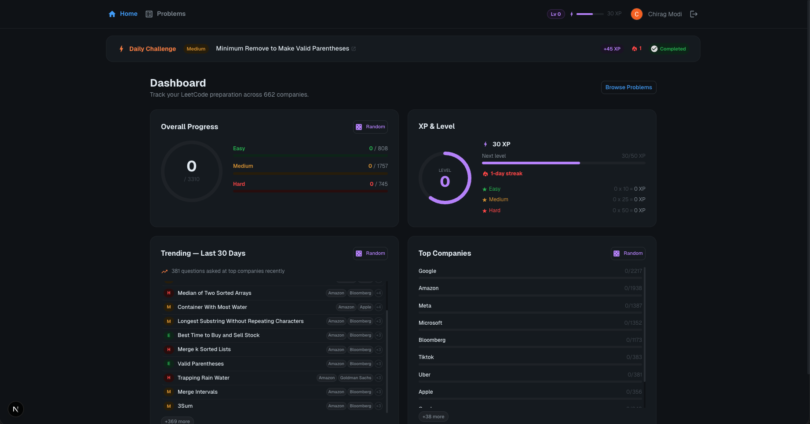

# LeetCode Tracker

A gamified LeetCode preparation dashboard built on top of company-wise interview question data. Track your progress, level up with XP, and tackle daily challenges from trending problems.



## Features

- **Company-Wise Questions** — 3,300+ problems from 660+ companies, categorized by recency (30 days, 3 months, 6 months, 1 year, all)
- **Search & Filter** — Find problems by title, difficulty, or company
- **Progress Tracking** — Mark questions as Todo, In Progress, Done, or Revisit (persisted in Firestore)
- **Dashboard Cards**
  - **Overall Progress** — Circular progress ring with difficulty breakdown
  - **XP & Levels** — Earn XP for solving problems (Easy: 10, Medium: 25, Hard: 50), level up with a sqrt-based curve
  - **Trending — Last 30 Days** — Questions asked at top companies recently, with status tracking via modal
  - **Top Companies** — Progress across 50 top tech companies
- **Daily Challenge** — A deterministic daily Medium question from trending problems, with streak tracking and bonus XP
- **Google Sign-In** — Firebase Authentication for seamless login

## Tech Stack

| Layer | Technology |
|-------|-----------|
| Framework | Next.js 16 (App Router) |
| UI | Material-UI (MUI) |
| Auth | Firebase Authentication (Google) |
| Database | Cloud Firestore |
| Data | CSV parsing at build time into static JSON |
| Theme | Neon dark theme |

## Project Structure

```
├── README.md
├── problems/              # Company-wise question data (synced from upstream daily)
│   ├── amazon/
│   ├── google/
│   ├── meta/
│   └── ... (660+ companies)
├── leetcode-tracker/       # Next.js application
│   ├── app/               # App router pages
│   ├── components/        # React components
│   │   ├── cards/         # Dashboard card components
│   │   ├── Header.tsx
│   │   ├── Dashboard.tsx
│   │   ├── DailyChallenge.tsx
│   │   └── ...
│   ├── lib/               # Hooks and utilities
│   │   ├── useAuth.ts
│   │   ├── useProgress.ts
│   │   ├── useGamification.ts
│   │   └── firebase.ts
│   ├── scripts/           # Build-time data parsing
│   └── data/              # Local config (top companies list)
└── .github/workflows/     # Daily upstream sync
```

## Getting Started

### Prerequisites

- Node.js 18+
- A Firebase project with Google Auth and Firestore enabled

### Setup

```bash
cd leetcode-tracker
npm install

# Copy and fill in your Firebase config
cp .env.local.example .env.local

# Parse problem data and start dev server
npm run dev
```

### Environment Variables

Create `leetcode-tracker/.env.local` from the example template:

```
NEXT_PUBLIC_FIREBASE_API_KEY=your-api-key
NEXT_PUBLIC_FIREBASE_AUTH_DOMAIN=your-project.firebaseapp.com
NEXT_PUBLIC_FIREBASE_PROJECT_ID=your-project-id
NEXT_PUBLIC_FIREBASE_STORAGE_BUCKET=your-project.appspot.com
NEXT_PUBLIC_FIREBASE_MESSAGING_SENDER_ID=your-sender-id
NEXT_PUBLIC_FIREBASE_APP_ID=your-app-id
```

## Data Source

Problem data is sourced from [snehasishroy/leetcode-companywise-interview-questions](https://github.com/snehasishroy/leetcode-companywise-interview-questions) and synced daily via GitHub Actions into the `problems/` directory.

## Gamification

| Action | XP |
|--------|-----|
| Solve Easy | +10 |
| Solve Medium | +25 |
| Solve Hard | +50 |
| Daily Challenge | +20 bonus |
| Unmark solved | Deducts XP |

**Level formula:** `Level = floor(sqrt(totalXP / 50))`

Milestones: Lv 1 = 50 XP, Lv 5 = 1,250 XP, Lv 10 = 5,000 XP, Lv 20 = 20,000 XP
